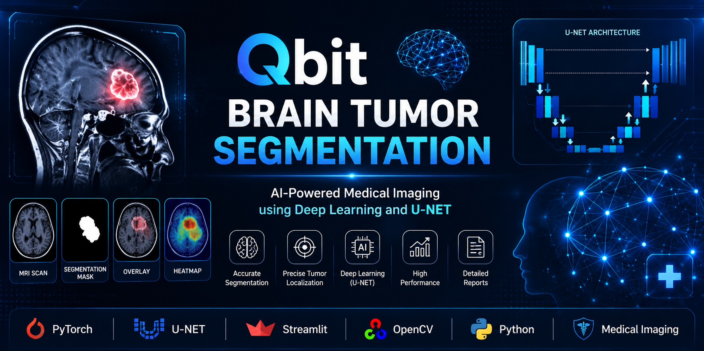
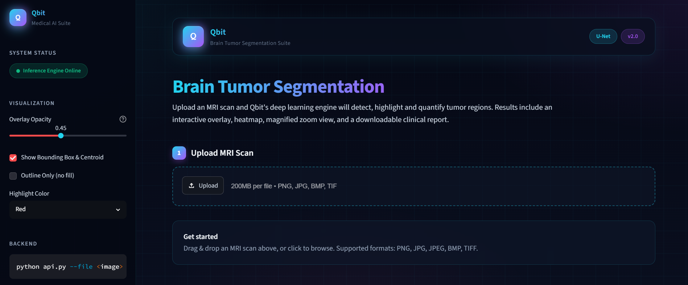
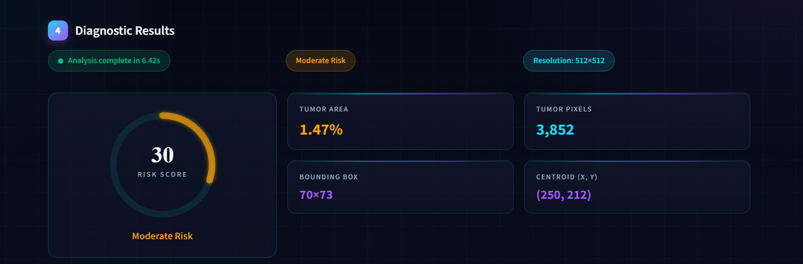
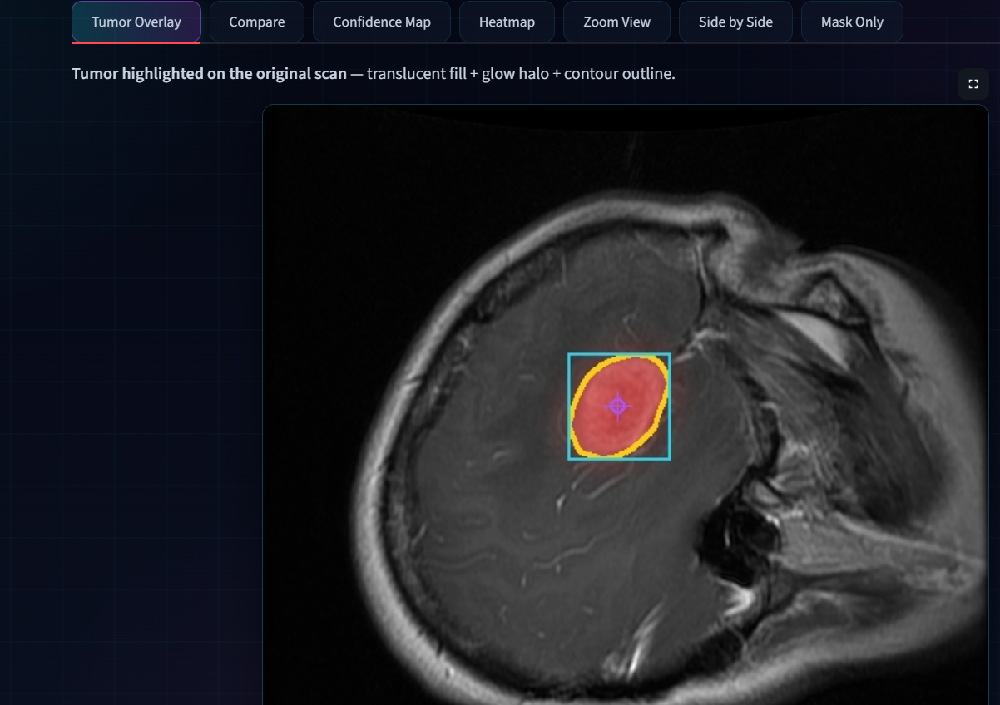

# 🧠 Qbit Brain Tumor Segmentation

> AI-powered medical imaging system for automatic brain tumor segmentation from MRI scans using Deep Learning (U-Net).

<p align="center">
  
</p>

---

## 📌 Overview

Qbit Brain Tumor Segmentation is an AI-powered medical imaging application that automatically identifies and segments brain tumors from MRI scans.

The system is built using the U-Net convolutional neural network architecture and provides an interactive web interface where users can upload MRI images and instantly receive segmentation results, tumor measurements, confidence visualization, and downloadable reports.

The project was developed as a Graduation Project to demonstrate the application of Artificial Intelligence in medical image analysis.

---

# ✨ Features

- Upload MRI scans directly from the browser
- Automatic Brain Tumor Segmentation
- U-Net Deep Learning Model
- Tumor Area Calculation
- Tumor Pixel Count
- Bounding Box Detection
- Tumor Centroid Localization
- Confidence Map
- Heatmap Visualization
- Overlay on Original MRI
- Adjustable Overlay Opacity
- Side-by-Side Comparison
- Mask Visualization
- Download Results
- Download Clinical Report
- Interactive Streamlit Interface

---

# 🏗️ System Architecture

```text
MRI Image
      │
      ▼
Image Preprocessing
      │
      ▼
U-Net Segmentation Model
      │
      ▼
Binary Tumor Mask
      │
      ├────────► Tumor Area
      ├────────► Bounding Box
      ├────────► Centroid
      ├────────► Confidence Map
      ├────────► Heatmap
      ▼
Interactive Visualization
      │
      ▼
Clinical Report
```

---

# 🧠 Deep Learning Model

Model Architecture

- U-Net
- Encoder-Decoder Architecture
- Skip Connections
- Pixel-wise Segmentation

Framework

- PyTorch

Image Size

- 512 × 512

Output

- Binary Tumor Mask

---

# ⚙️ Technologies

| Technology | Usage |
|------------|-------|
| Python | Backend |
| PyTorch | Deep Learning |
| Streamlit | Web Application |
| NumPy | Numerical Computing |
| Pillow | Image Processing |
| Matplotlib | Visualization |
| OpenCV | Image Processing |

---

# 📂 Project Structure

```
Qbit-Brain-Tumor-Segmentation
│
├── app.py
├── api.py
├── requirements.txt
├── saved_models
├── bts
├── images
├── temp
└── README.md
```

---

# 🖥️ Application Workflow

1. Upload MRI Scan

2. Image Preprocessing

3. Tumor Segmentation

4. Mask Generation

5. Tumor Analysis

6. Visualization

7. Report Generation

---

# 📊 Generated Results

The application provides:

- Tumor Segmentation Mask
- Overlay Visualization
- Confidence Map
- Heatmap
- Tumor Area Percentage
- Tumor Pixel Count
- Bounding Box
- Tumor Center
- Risk Indicator
- Downloadable Images
- Clinical Report

---

# 🚀 Live Demo

👉 **Streamlit Application**

> https://YOUR_STREAMLIT_LINK

---

# 💻 Installation

Clone the repository

```bash
git clone https://github.com/dragon-collab/Qbit-Brain-Tumor-Segmentation.git
```

Install dependencies

```bash
pip install -r requirements.txt
```

Run the application

```bash
streamlit run app.py
```

---

# 📸 Screenshots

## Home

<p align="center">

</p>

---

## Diagnostic Results

<p align="center">

</p>

---

## Tumor Overlay

<p align="center">

</p>

---

# 📈 Future Improvements

- 3D MRI Volume Segmentation
- Multi-Class Tumor Segmentation
- Automatic Tumor Classification
- DICOM Support
- PACS Integration
- PDF Clinical Reports
- Doctor Dashboard
- Patient History

---

# 👥 Team

Qbit Team

Graduation Project


---

# 📄 License

This project is developed for educational and research purposes.

MIT License
